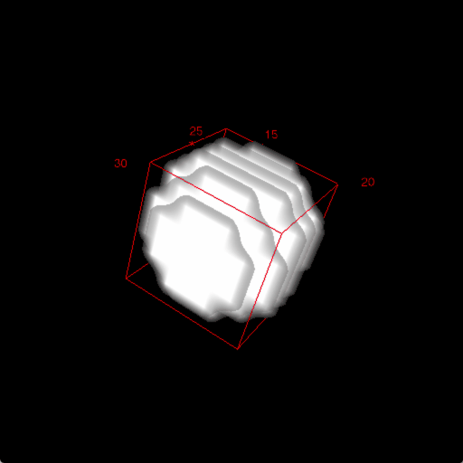
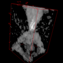
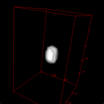

# MuSCAT

This is an attempt to invert multiple scattering based on Beam Propagation Method (BPM) implement in Tensorflow. 
We're refering to this [publication.](http://www.focusonmicroscopy.org/2018/PDF/1094_Diederich.pdf)

## Installation 
# Install Tensorflow-GPU following this [guide](https://www.codingforentrepreneurs.com/blog/install-tensorflow-gpu-windows-cuda-cudnn/).
´´´
pip install tifffile 
pip install matplotlib
pip install pyyaml
pip install scipy
pip install scikit
´´´

## Data
Data can be provided upon request.

## Examples
### 3D Sphere immersed in Water
This is the sliced 3D object :

This is the output of the partially coherent fwd model (Q-PHASE):

After minimizing the L2-norm and applying the TV-Regularizer with lambda=1e-3 after 1000 iterations:

### Simulated cheek-cell 'imaged' using single and multiple scattering

This one is the result after a convolution of the `ASF` with the scattering potential `V`:

This one is the result after full BPM simulation of the partially-coherent image-formation using the same sample:
